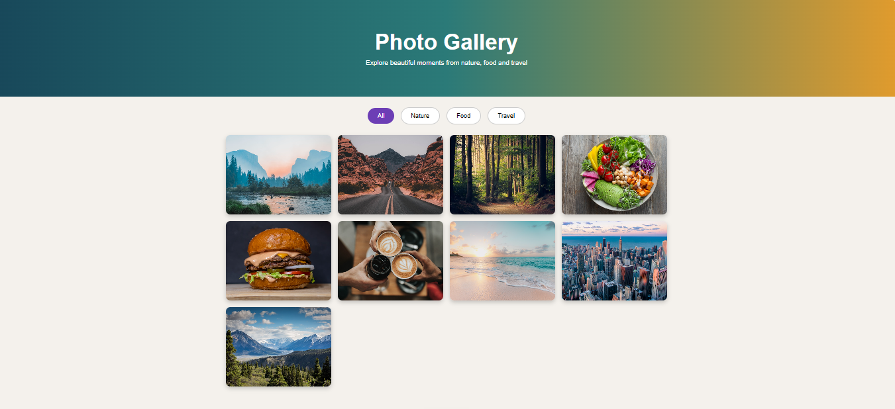
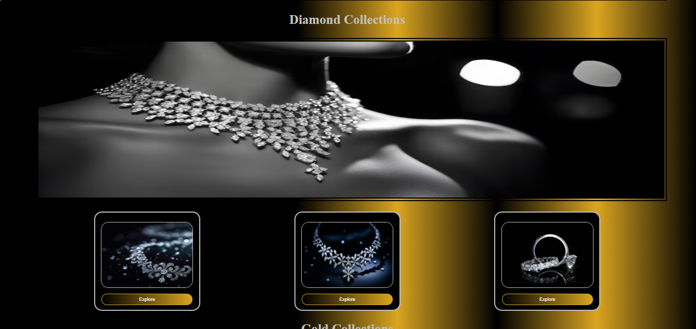
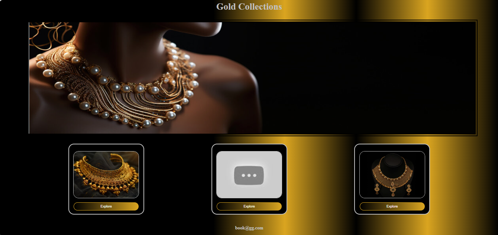

# Responsive Photo Gallery Website

## Project Description

This is a responsive photo gallery website developed using HTML, CSS, and JavaScript. The website provides an attractive gallery layout that works on desktop, tablet, and mobile devices.

## Features

* Responsive design
* Mobile-friendly layout
* Image gallery display
* Clean and simple user interface

## Technologies Used

* HTML5
* CSS3
* JavaScript

## Folder Structure

Responsive-Photo-Gallery-Website/
│
├── photogallery.html
├── jquery.html
├── README.md
├── Screenshot 2026-06-07 151747.png
├── Screenshot 2026-06-07 151951.png
└── Screenshot 2026-06-07 152121.png

## Live Demo

[View Project](https://sasiraja045-code.github.io/Responsive-Photo-Gallery-Website/)

## Project Files

* photogallery.html
* jewellery.html

## How to Run

1. Download or clone the repository.
2. Open the project folder.
3. Open photogallery.html in a web browser.

## Author

Srinithi

Email: [sasiraja045@gmail.com](mailto:sasiraja045@gmail.com)

## Project Preview

